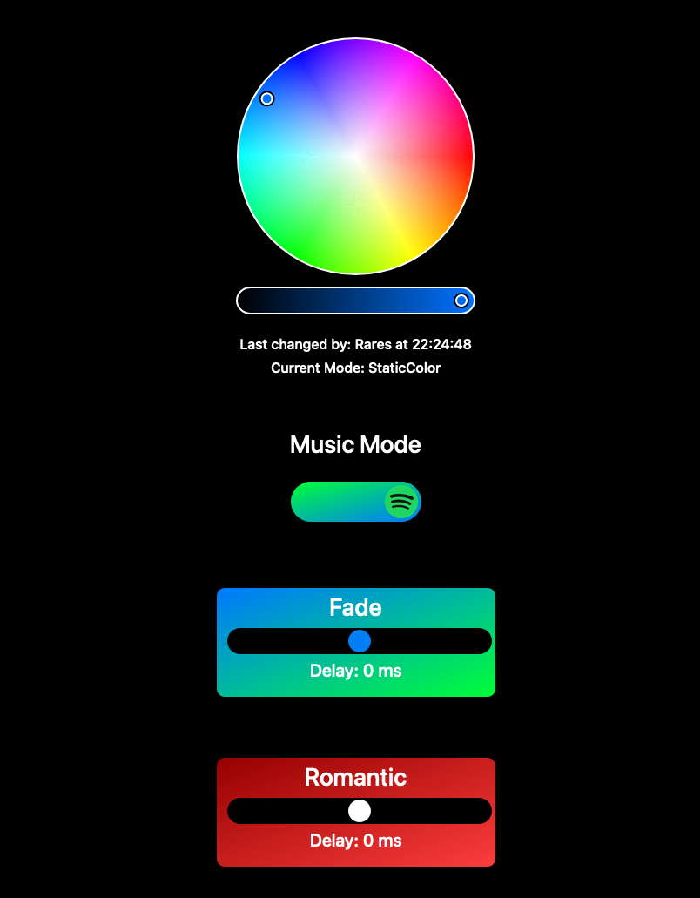

<p align="center">
  <h1 align="center">ESP8266 Smart Led Lights</h1>

  <p align="center">
    WiFi controlled Led Lights
    <br />
    <br />
    <a href="https://github.com/Dexter0-0/SmartLedLights-v2"><strong>Read the code »</strong></a>
    <br />
    <br />
    <a href="https://github.com/Dexter0-0/SmartLedLights-v2/issues">Report Bug</a>
    ·
    <a href="https://github.com/Dexter0-0/SmartLedLights-v2/issues">Request Feature</a>
  </p>
</p>


<!-- TABLE OF CONTENTS -->
<details open="open">
  <br />
  <summary>Table of Contents</summary>
  <ol>
    <li>
      <a href="#about-the-project">About The Project</a>
      <ul>
        <li><a href="#built-with">Built With</a></li>
      </ul>
    </li>
    <li>
      <a href="#getting-started">Getting Started</a>
      <ul>
        <li><a href="#hardware">Hardware</a></li>
        <li><a href="#esp8266">ESP8266</a></li>
        <li><a href="#wifi">Wi Fi Port Forwarding</a></li>
        <li><a href="#python">Python script</a></li>
      </ul>
    </li>
    <li><a href="#usage">Usage</a></li>
    <li><a href="#screenshots">Screenshots</a></li>
    <li><a href="#contributing">Contributing</a></li>
    <li><a href="#license">License</a></li>
    <li><a href="#contact">Contact</a></li>
  </ol>
</details>


<!-- ABOUT THE PROJECT -->
## About The Project

There are a lot of Led Light Controllers out there but this one is highly customizable, responsive and can be controlled from anywhere in the world. You can also give acces to multiple people to control your Leds and see who changed what and when. At the moment, the Smart Led Lights come with this features:

<br />

Feature | Explanation
------------ | -------------
Static color | Choose one of 16.777216 colors
Music Mode | Turning the Music Mode ON will make the Leds sync with the music you are listening to on Spotify
Animate Current Color | Takes the current color and transitions between making it dimmer or brighter as fast or slow as you want
Fade | Transitions between randomly generated colors as fast or slow as you want
Romantic | Transitions between randomly generated shades of Red, Pink and Purple as fast or slow as you want
Monochrome | Transitions between black (turnt off) and bright white as fast or slow as you want

<br />
The Smart Led Lights have 3 components:
<br />
* Web and WebSocket Servers that run on an ESP8266 connected to the Leds
<br />
* The Users Device (Phone, Tablet, PC or Smart Fridge)
<br />
* A Python Script that gets the currently playing song and the data the Server needs to sync with the song
<br />

### Built With

Backend:
* [ESP8266WiFi](https://arduino-esp8266.readthedocs.io/en/latest/esp8266wifi/readme.html)
* [WiFiClient](https://www.arduino.cc/en/Reference/WiFiClient)
* [ESP8266WebServer](https://github.com/esp8266/Arduino/tree/master/libraries/ESP8266WebServer)
* [WebSocketsServer](https://github.com/Links2004/arduinoWebSockets)
* [ArduinoJson](https://arduinojson.org/)
<br />

Frontend:
* [Bootstrap](https://getbootstrap.com)
* [iro.js](https://github.com/jaames/iro.js)
<br />

Python Script:
* [Websockets](https://websockets.readthedocs.io/en/stable/index.html)
* [Spotipy](https://spotipy.readthedocs.io/en/2.12.0/#)

<!-- GETTING STARTED -->
## Getting Started

In order to use the Smart Led Lights you need to follow this steps:

### Hardware

<ol>
    <li>Connect the Led Strip to an ESP 8266</li>
    <li>Red -> D7</li>
    <li>D7 Green -> D6</li>
    <li>Blue -> D5</li>
    <li>Black -> GND</li>
    <li><a href="https://cdn.instructables.com/ORIG/FDY/2GF8/ILTQF2S9/FDY2GF8ILTQF2S9.gif?frame=1"> If the Led Strip requires 12V use a different power source for them and make a circuit using mosfets like this one</a></li>
</ol>


### esp8266

<ol>
    <li>Configure Arduino IDE to use the ESP8266 <a href="https://randomnerdtutorials.com/how-to-install-esp8266-board-arduino-ide/">tutorial here</a></li>
    <li>Download the libraries under "Backend" from <a href="#built-with">here</a></li>
    <li>Change the WiFiSSID and WiFiPassword variables to your networks SSID and Password</li>
    <li>Change the WebServerPort and WebSocketsPort variables to what port number you want</li>
    <li>Change the routes in setup to your desired password and allowed users ex: WebServer.on("/password=12345678&user=dexter", ServeMainPage);</li>
    <li>Change the websocket route in index.h with your ip (local or public ~see below~)</li>
    <li>Upload your code to the ESP8266</li>
</ol>

### WiFi

! Follow this steps only if you want to be able to access the Leds outside your network !

<ol>
    <li>Go to port forwarding on your routers webpanel <a href="https://www.noip.com/support/knowledgebase/general-port-forwarding-guide/">tutorial here</a></li>
    <li>Open the Serial in Arduino IDE after uploading the code on the ESP8266 and get the assigned IP of the ESP8266</li>
    <li>Forward the ports WebServer and WebSockets ports (can be changed in the code) to the ESP8266 Local IP</li>
</ol>

### Python

Install the following libraries using pip

  ```sh
  pip install lib 0
  ```
  
  ```sh
  pip install lib 1
  ```
  
  ```sh
  pip install lib 2
  ```
!! TODO write here how to make a spotify app and allow an account to use it and use spotipy


<!-- USAGE EXAMPLES -->
## Usage

In order to control the Leds you need to open a browser on any device and enter the local IP of the ESP8266 (visible in Serial) or your public IP if you port forwarded <a href="wifi">see here</a> followed by :WEB_SERVER_PORT/password=YOUR_PASSWORD&user=YOUR_USER

<!-- SCREENSHOTS -->
## Screenshots


<!-- CONTRIBUTING -->
## Contributing

Contributions are what make the open source community such an amazing place to be learn, inspire, and create. Any contributions you make are **greatly appreciated**.

1. Fork the Project
2. Create your Feature Branch 
3. Commit your Changes 
4. Push to the Branch 
5. Open a Pull Request

<!-- LICENSE -->
## License

Distributed under the MIT License. See `LICENSE` for more information.


<!-- CONTACT -->
## Contact

Nandra Rares - nandrarares16@gmail.com
